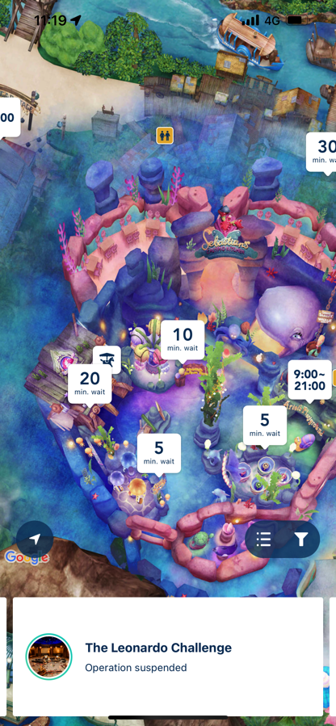

算起来今年己经是连续做年末总结的第7年了，不知不觉工作也快10个年头了，见[末总结系列](https://blog.xiaomo.info/categories/summary/)。如果要说进入到2023年是什么感觉的话，我最大的感觉就是没有实感，还没有做好任何准备2023年就己经到来了，因为此时此刻(2023年1月3日)我才刚刚开始写年末总结，年纪越大越觉得时间飞速流逝，也或者记忆力衰退，以至于2022年经过的一些事情的细节都己经不太能想起来了。

###### <!-- more -->

# 2022年回顾
年末年始放假这段时间去汤泽滑雪，很多事情都没有做，现在假期结束收一收心把2022年留下的一些尾巴给完成。回复翻看了一下[2022年的年末总结](https://blog.xiaomo.info/2021/summary)，其实觉得总结的挺没有条理的，导致今年想根据去年的年末总结做一下复盘的时候看起来比较费力。
## 关键节点
### 2022年3月
从CTW离职，4月加入[U-NEXT](https://github.com/u-next)的`Core Team`开始了`full remote`的工作，技术栈是`grpc`+`graphQL`，也都是完全没有接触过的东西所以在边学习边做Task的状态下工作着，遇到了非常好的前辈在工作的时候给我很多帮助。目前后端用的技术如下：

### 2022年5月
报考了摩托车`400CC`的手动档的学习，在边工作边学习的状态下1个半月拿到驾照，学习的时候用车是CB400，非常帅气的摩托。

### 2022年7月
和小伙伴们一起去了东京迪士尼的`sea`和`land`，算是圆了迪士尼之梦，总体感觉来说是女孩子喜欢的类型，建筑很好看，但人也很多。

## 取成的一些成果
如果说2022年取得最大的成果的话，算是考取的云计算方面的证书了吧，涉及到Linux、IaC、AWS、Kubernetes共7个证书，且都是在零基础的情况下学习并获得。上半年的重点是学习各种基础，下半年的重点是针对考点进行练习。

## 遇到的机遇和挑战

## 遇到的哪些不足

# 2023年计划
