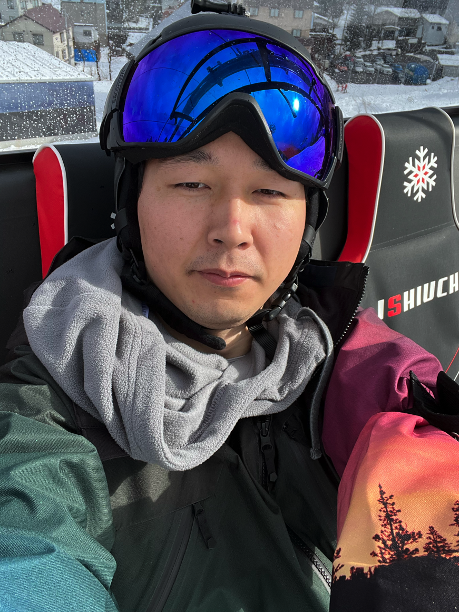
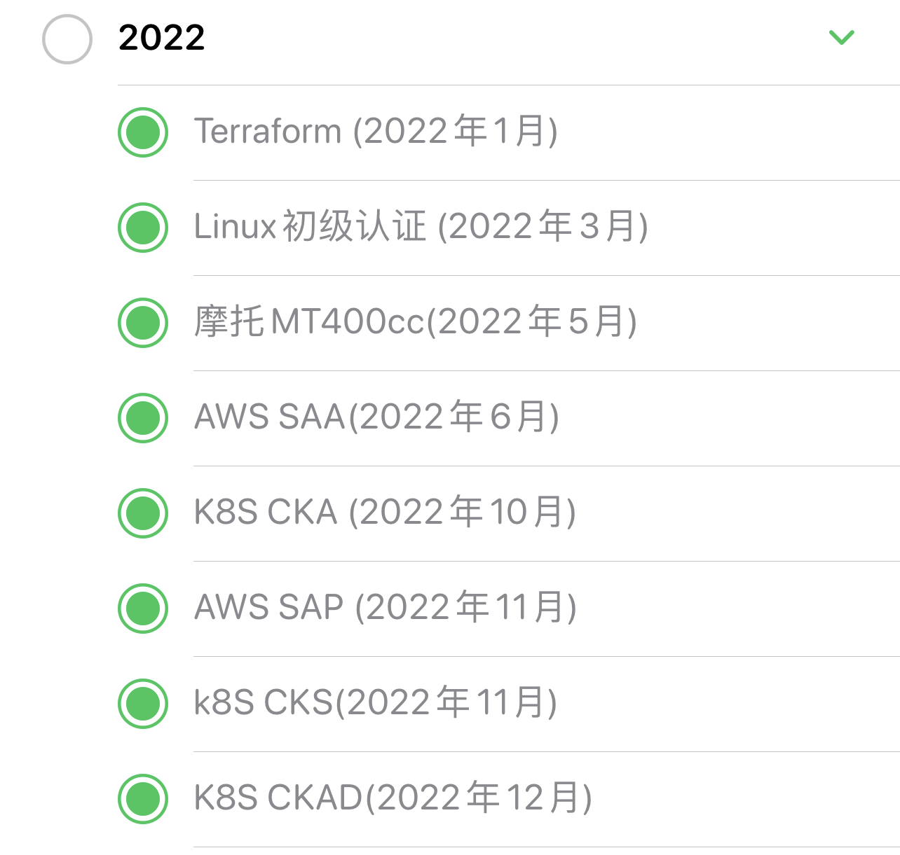

算起来今年己经是连续做年末总结的第7年了，不知不觉工作也快10个年头了(见[末总结系列](https://blog.xiaomo.info/categories/summary/))。如果要说进入到2023年是什么感觉的话，我最大的感觉就是没有实感，还没有做好任何准备2023年就己经到来了，因为此时此刻(2023年1月3日)我才刚刚开始写年末总结，年纪越大越觉得时间飞速流逝，也或者记忆力衰退，以至于2022年经过的一些事情的细节都己经不太能想起来了。

 <!-- more -->

# 2022年回顾
年末年始放假这段时间去汤泽滑雪，很多事情都没有做，现在假期结束收一收心把2022年留下的一些尾巴给完成。回复翻看了一下[2022年的年末总结](https://blog.xiaomo.info/2021/summary)，其实觉得总结的挺没有条理的，导致今年想根据去年的年末总结做一下复盘的时候看起来比较费力。
## 关键节点
### 2022年3月
从CTW离职，4月加入[U-NEXT](https://github.com/u-next)的`Core Team`开始了`full remote`的工作，技术栈是`grpc`+`graphQL`，也都是完全没有接触过的东西所以在边学习边做Task的状态下工作着，遇到了非常好的前辈在工作的时候给我很多帮助。目前后端用的技术如下：

### 2022年4月
因为换工作签证需要更新，所以4月的前半个月一直闲着比较无聊所以在研究着做新菜，感觉学会的特别喜欢吃的2个菜是`红烧肉`和`虾`

### 2022年5月
报考了摩托车`400CC`的手动档的学习，在边工作边学习的状态下1个半月拿到驾照，学习的时候用车是`CB400`，非常帅气的摩托。

### 2022年6月
开始了kubernetes官网的[直播讲解](https://www.bilibili.com/video/BV1xT411V7PS/?spm_id_from=333.788&vd_source=5d53663fb3b2a3bc29d26340677926c6)，一共录了有100多期，主要内容就是和对kubernetes感兴趣的朋友一起在`zoom`对`k8s`官网上的知识点进行系统的讲解和学习。对应笔记有`官网学习路线`，`k8s资源合集`，`kubectl命令大全`，`常用工具`,`实战训练`,`踩坑记录`，`资源收集`共7个模块。

### 2022年7月
和小伙伴们一起去了东京迪士尼的`sea`和`land`，算是圆了迪士尼之梦，总体感觉来说是女孩子喜欢的类型，建筑很好看，但人也很多。

### 2022年8月
开始自学`吉他`，坚持了大概2个月左右，录了几首弹唱。但是意识到如果不抓紧时间的话2022年的考证计划应该就没办法完成了，所以算是鸽了，2023年会重新拾起来的。

<iframe src="//player.bilibili.com/player.html?aid=857181261&bvid=BV1GV4y1x7v4&cid=808343626&page=1" width="100%" height="600px" scrolling="no" border="0" frameborder="no" framespacing="0" allowfullscreen="true"> </iframe>

### 2022年9月
之前一直想打乒乓球，所以在住的地方约了体育馆但是经常约不上，后来在朋友的推荐下去了`round1`，感觉发现了新大陆。不仅有`乒乓球`，还有`篮球`，`保龄球`，`飞镖`，`唱歌`等十几种可以玩的设施，价格还超级实惠，此后便成了我经常光顾的游玩地。

### 2022年10月
买了自行车开始骑行锻炼身体，从最初的`30公里`到后来能够一次骑`80公里`，我最开始是不相信自己能有这个能力骑这么长的距离。所以不得不感慨，人的潜力是非常大的，如果自己不去尝试，永远都不知道自己的极限在哪里。

### 2022年11月
考虑了很久最终还是买了车，从杭州到日本之后过了几年把`思域`给卖了一直是我的一块心病，所以最终还是在日本买了车。理智上来说我买车的时机不是很好，但是能够极大的提升生活的幸福指数，人活着不就是为了能够开心一点么？

### 2022年12月
自驾去`石打丸山`滑雪跨年，从去年开始接触滑雪之后便对滑雪抱有很大的兴趣，自己买了全套的滑雪装备。去年学习的技能是落叶飘，希望今年能够学会换刃。

## 取成的一些成果
如果说2022年取得最大的成果的话，算是考取的云计算方面的证书了吧，涉及到Linux、IaC、AWS、Kubernetes共7个证书，且都是在零基础的情况下学习并获得。上半年的重点是学习各种基础，下半年的重点是针对考点进行练习。

## 遇到的机遇和挑战

## 遇到的哪些不足

# 2023年计划
