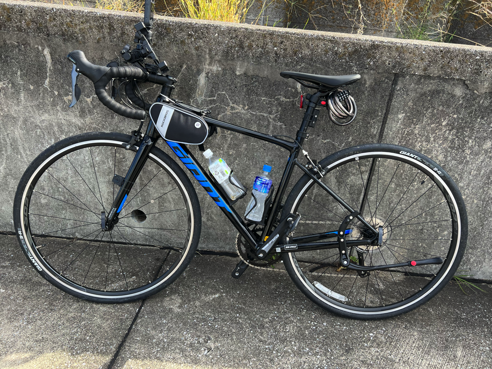
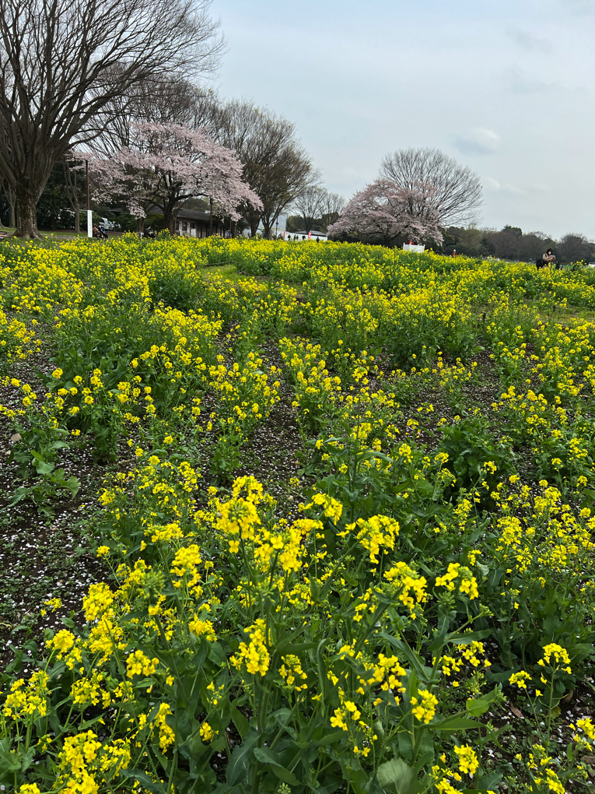

hello,大家好！我是小莫，算起来今年己经是连续做年末总结的第7年了(见[末总结系列](https://blog.xiaomo.info/categories/summary/))，不知不觉工作也快10个年头了。如果要说进入到2023年是什么感觉的话，我最大的感觉就是没有实感，还没有做好任何准备2023年就己经到来了，因为此时此刻(2023年1月3日)我才刚刚开始写年末总结，年纪越大越觉得时间飞速流逝，也或者记忆力衰退，以至于2022年经过的一些事情的细节都己经不太能想起来了。年末年始放假这段时间去汤泽滑雪，很多事情都没有做，现在假期结束收一收心把2022年留下的一些尾巴给完成。回复翻看了一下[2022年的年末总结](https://blog.xiaomo.info/2021/summary)，其实觉得总结的挺没有条理的，导致今年想根据去年的年末总结做一下复盘的时候看起来比较费力，所以今年做总结的时候尽量做的有条理一些。

 <!-- more -->
## 2022年大事件
### 2022年3月-转职
从[CTW](https://ctw.inc/)离职，4月加入[U-NEXT](https://github.com/u-next)的CoreTeam开始了`Full Remote`的工作，主要技术栈是 `golang`、`python`、`nodejs`、`grpc`、`GraphQL`和`k8s`。也都是大多没有接触过的东西。所以在边学习边做Task的状态下工作着，遇到了非常好的前辈在工作的时候给我很多帮助。目前后端用的技术如下：

闲暇之余折腾了自己的家庭影院，我像一个网络仓鼠一样把喜欢的电视剧、电影、动漫都下载到`NAS`上保存，这让我感觉到了极大的满足感。在AppleTV上安装了`plex`然后就可以随时观看下载的电影，感觉非常的棒。

### 2022年4月-做菜
因为换工作签证需要更新，所以4月的前半个月一直闲着比较无聊所以在研究着做新菜，感觉学会的特别喜欢吃的2个菜是`红烧肉`和`虾`。

### 2022年5月-摩托驾照
报考了摩托车`400CC`的手动档的学习，在边工作边学习的状态下1个半月拿到驾照，学习的时候用车是`CB400`，非常帅气的摩托且值得入手。

### 2022年6月-k8s直播
开始了kubernetes官网的[直播讲解](https://www.bilibili.com/video/BV1xT411V7PS/?spm_id_from=333.788&vd_source=5d53663fb3b2a3bc29d26340677926c6)，一共录了有100多期，主要内容就是和对kubernetes感兴趣的朋友一起在`zoom`对`k8s`官网上的知识点进行系统的讲解和学习。对应笔记有`官网学习路线`，`k8s资源合集`，`kubectl命令大全`，`常用工具`,`实战训练`,`踩坑记录`，`资源收集`共7个模块。

### 2022年7月-迪士尼之行
和小伙伴们一起去了东京迪士尼的`sea`和`land`，算是圆了迪士尼之梦，总体感觉来说是女孩子喜欢的类型，建筑很好看，但人也很多。

### 2022年8月-自学吉他
开始自学`吉他`，坚持了大概2个月左右，录了几首弹唱。但是意识到如果不抓紧时间的话2022年的考证计划应该就没办法完成了，所以算是鸽了，2023年会重新拾起来的。
<iframe src="//player.bilibili.com/player.html?aid=857181261&bvid=BV1GV4y1x7v4&cid=808343626&page=1" width="100%" height="600px" scrolling="no" border="0" frameborder="no" framespacing="0" allowfullscreen="true"> </iframe>

### 2022年9月-ROUND1
之前一直想打乒乓球，所以在住的地方约了体育馆但是经常约不上，后来在朋友的推荐下去了`round1`，感觉发现了新大陆。不仅有`乒乓球`，还有`篮球`，`保龄球`，`飞镖`，`唱歌`等十几种可以玩的设施，价格还超级实惠，此后便成了我经常光顾的游玩地。

### 2022年10月-骑行
买了自行车开始骑行锻炼身体，从最初的`30公里`到后来能够一次骑`80公里`，我最开始是不相信自己能有这个能力骑这么长的距离。所以不得不感慨，人的潜力是非常大的，如果自己不去尝试，永远都不知道自己的极限在哪里。

### 2022年11月-买车
考虑了很久最终还是买了车，从杭州到日本之后把思域卖了一直是我的一块心病，所以还是在日本买了车。理智上来说买车的时机不是很好，但是能够极大的提升生活的幸福指数，人活着不就是为了能够开心一点么？

### 2022年12月-滑雪
自驾去`石打丸山`滑雪跨年，从去年开始接触滑雪之后便对滑雪抱有很大的兴趣，自己买了全套的滑雪装备。去年学会的技巧是落叶飘，希望今年能够学会换刃。今年己经是在雪场进行的第二个跨年了，感觉跨年果然还是要吃烤肉。

## 2022年主要成果
### 考取的云计算证书
如果说2022年取得最大的成果的话，那应该是考取的云计算方面的证书了吧，涉及到`Linux`、`IaC`、`AWS`、`Kubernetes`共7个[证书](https://www.credly.com/users/xiaomoinfo/badges)，且大部分是在零基础的情况下学习并获得。上半年的重点是学习各种基础，下半年的重点是针对考点进行练习，所以取得证书的时间多集中在下半年。

### Notion笔记展示
第2个我觉得算得上比较有成就感的就是把所有的笔记从`onenote`转移到了`notion`上，并对之前总结的比较零散的东西进行了整理。可以说现在notion是我工作生活中必不可少的一部分，目前主要的大模块如下:

### B站Up主成果
前几年对游戏开发相关的技术比较感兴趣，于是搬运了`Unity3D`、`UE4`的一些视频到[B站](https://space.bilibili.com/6721344)。从2021年开始录制了一些关于`AWS`、`Linux`、`K8S`的一些视频，获得了很多好的反馈，现在总播放量破百万粉丝数也有近2万人了。

### 开源了wechatgpt
在刷推的时候发现大家都在聊`chatgpt`，因此突发其想能不能把它的api集成到微信上。于是进行了一番研究开源了[wechatgpt](https://github.com/houko/wechatgpt)。刚开始只支持微信，后来发现微信容易封号，又加了`telegram`，之后为了方便部署又打了docker镜像到`dockerHub`，发布不到一个月没有任何推广的情况下star破百，还是比较受到大家喜欢的，如果感兴趣的朋友也可以自己玩一下，后续计划准备用flutter做一个App来使用。

### Blog迁移到hugo
之前用`hexo`也有6年时间了，博客的主题经过我的各种魔改己经岌岌可危，但是一直犯懒就没有修复。为了能够有点新鲜感把博客迁移到了`hugo`也用上了新的主题，经过各种配置和整理现在看起来己经顺眼多了。在整理笔记的时候发现从2016开始写博客开始，数量逐年下降。原因我总结了一下：是从2018年之后开始用云笔记之后平时要记录的东西都放在笔记里，慢慢的很少写博客了。2021年更是只有一个年末总结，其实本来计划要写的内容还是有几篇的，但是给自己堆的事情太多了就搁置了，希望2023年能够多产出几篇有价值的博客。

### 在udemy上更新课程
目前在udemy上更新了[CKAD](https://www.udemy.com/course/kubernetes-ckad)和[CKS](https://www.udemy.com/course/kubernetes-cks/?couponCode=4089B1C0F52EE279CBB3)的课程，有需要的小伙伴可以点击链接购买，如果优惠过期了可以联系小莫要优惠码。之后还会推出更多的课程，希望小伙伴们能够多支持。

### 坚持开源项目
从2015年注册[github](https://github.com/houko)开始，一直坚持参与与各种开源项目。

## 2022年遇到的机遇和挑战
### 机遇
塞翁失马，焉知非福。因为一些原因从CTW离职了，但是找到了现在的工作，感觉非常开心。如果有注意到，能够发现我的关键时间点是从3月份开始的，因为我也正是在3月份离职的。在CTW是没有自己的生活，一切的时间都被繁琐的工作填满，换了工作之后不仅收入增加了，而且自我提升时间变多了，整个人的生活状态都有了翻天覆地的变化，不得不说选择真的非常重要。

### 挑战
加入[U-NEXT](https://video.unext.jp/)之后首先要适应的就是`remote work`，对于自控力较差的人来说`remote`就意味着没有人监督，工作上和生活人都会产生很大懈怠。于是我为了能够和正常出勤保持一致的节奏，坚持每天7点钟起床然后直播1小时，之后吃饭休息到10点和之前同样的时间上班。也给自己增加了一些锻炼身体的项目，做了日程表来严格执行，总体来说这一年效果还是比较满意的。

[U-NEXT](https://video.unext.jp/)现在在`app store`的排名是`31`，还在`twitter`和`Disney+`前面哦，喜欢看电影的朋友不妨尝试一下。

## 2022年做的不足的地方
### 焦虑
在经历了而立之年后深刻的体会到了时不我待，每天都觉得时间不够用，觉得有非常多的东西需要我去学习，因此给自己定了太多的目标导致整个人很焦虑，在没有如期完成的时候会变的自我否定。

### 精力分散
也是因为自己定了太多的目标，导致时间太分散，最终要做的事情很多都是只做了一半。

### 缺乏持之以恒的精神
对什么事情都很感兴趣，但是3分钟热度过后就坚持不下去。在2022年半途而废的就是锻炼身体（举铁、跳绳、篮球、跑步）坚持了几个月就不想做了，视频分享也是录了有十几期之后就停更了，博客也是一整年都没有更新。

## 2023年计划
### 日语
一直都知道语言是自己的短板，但是因为对技术的热爱让自己把大部分时间都花在了学习新的技术上，在面试的时候吃了很大的亏。于是下定决心，从2023年开始把重心放在学习语言上，早上和晚上技术直播的时候改成用来学习日语。

### 英语
上半年的主要目标是学习日语，下半年的目标是学习英语，坚持每天学习2个小时左右。

### 吉他
吉他是从小就喜欢的一种乐器，因为各种原因没有机会学习。现在有了自己的时间可以学习，希望能够作为自己的一个终生爱好。

### 练字
我对书法兴趣不大，但是对于写一手好看的字抱有极大的渴望。也许是天生是左手惯用手被后天强行改成右手导致写字一直写不好，因为从小练字贴的数量一点都不比别人少。虽然说现在大部分时间都是用电脑打字，但是书写作为一种基础的能力还是要努力精进一下，当然也是因为去年在twitter上立下了flag，给家里寄药写了个小纸条字丑到我自己了。

### 锻炼身体
随着年龄的越来越大，身体不高的情况下体重在不断的增加，再加上远程工作运动的机会就更少，完全进入了一个负面循环。因此要打破这种循环就需要坚持运动，让自己保持一个健康的身体。

### 独立开发者
从入行开始写`backend`，慢慢开始学习`frontend`相关的技术，再之后以`fullstack engineer`的职位面试并入职，顶着全桟工程师的职位己经工作了好几年，再加上云计算技术的补充，现在的我完全有能力以个人开发者的身份开发出一个能够商业性的产品，但还需要学习设计(figma)和产品(PMP)相关的能力。

### 课程录制
主业的工作只能维持正常的生活，能够往上提的空间有限，为此要拓展新的收入方式可以通过自己擅长的能力作为讲师把技术教授给需要的人。

### 视频剪辑
课程的录制难免需要进行后期处理，视频剪辑也是一个不可缺少的能力，因为主要用mac系统，所以打算系统学学`FCP`。

## 一些碎碎念
2022年也真是不平凡的一年，全世界发生了很多不可思议的事情。照之前的认知都是无法想象的事情，但是大家的接受能力也是惊人的，能够在极短的时间里了解、接受并苦中作乐。 而这一年：
### 我终于去看了错过了几年的樱花

### 近距离看了东京塔、晴空塔和摩天轮

### 认识了许多志同道合的小伙伴
朋友小心翼翼保护了一路生怕会碰到的完美蛋糕

### 去海边看了夕阳

### 去感受了圣诞的梦幻

### 自己开车去滑雪
第一天晚上就遇到大雪把车淹没了

### 收到了新年的礼物

### 看了心目中理想的房子
虽然这个目标有点遥远，但是：路不都是一步一步走出来的！ 我喜欢这种独栋小楼，可以安静的做自己喜欢做的事情，不用担心蹦蹦跳跳影响到楼下的邻居。

### 总结
岁月流逝如同河流奔腾，我们不停地向前奔跑却没有办法阻止它的流逝。一天又一天，一年又一年，时间一去不复返。我们的青春和年华悄悄流失，岁月的摧残无情地把我们推向老去。 但是，我们不能让岁月流逝的悲伤把我们淹没，我们要勇敢地向未来迈进。虽然我们已经迈过了许多岁月，但我们仍然有机会去实现我们的梦想。2023，Fighting!脚踏实地的去实现新的目标。